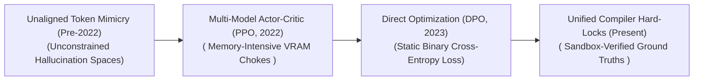
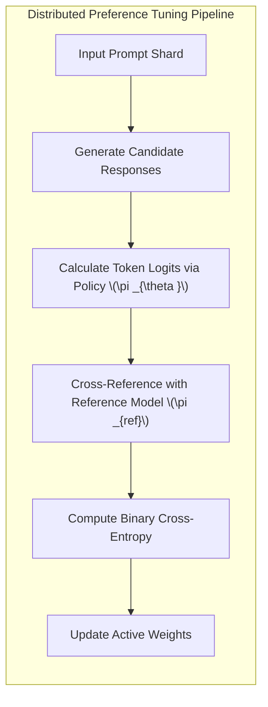

# Awesome-Preference-Tuning
## Preference Tuning in AI: History, Progression, Variants, & Applications

**Preference Tuning**—alternatively designated as human preference alignment, downstream behavior shaping, or value calibration optimization—is an advanced post-training paradigm in artificial intelligence designed to steer generative foundation models to conform to explicit human utility, safety, formatting style, and veracity standards [INDEX: 11, 25]. While initial self-supervised **Pre-training** optimizes models on massive token datasets to blindly mimic uncurated internet text [INDEX: 15], this frequently causes them to emit toxic tokens, execute hazardous payloads, or hallucinate false data. 

Preference Tuning serves as the critical behavior-shaping layer: by optimizing model parameters over comparative human or AI-vetted selection matrices, it warps the model's continuous latent logits [INDEX: 11]. This transitions the network from an unpredictable stochastic token-guesser into an aligned, reliable conversational assistant or specialized agentic tool [INDEX: 11, 12].

---

## 1. The Macro Chronological Evolution

The technical approach to value alignment has transitioned from unaligned text pools to fragile multi-model actor-critic loops, direct mathematical reparameterizations, and modern compiler-locked token verification enclaves.

| Era / Concept | Description | Year First Used | Paper Link |
| :--- | :--- | :--- | :--- |
| [**The Unaligned Generative Baseline Era (Pre-2022)**](unaligned-generative-baseline.md) | *Concept:* The core structural baseline. Machine learning networks optimized parameters strictly via next-token prediction over raw internet crawls [INDEX: 15]. The models possessed absolute zero internal awareness of safety boundaries or human formatting preferences, operating entirely as passive mirrors of public web data noise [INDEX: 15]. | Pre-2022 | N/A |
| [**The Multi-Model Actor-Critic Era (Classic RLHF / PPO, ~2022–2023)**](multi-model-actor-critic.md) | *Concept:* Introduced structured behavioral shaping by training models against human preference selections [INDEX: 11]. Popularized by OpenAI (InstructGPT/ChatGPT), crowd-sourcers graded parallel completions to train an explicit **Reward Model** [INDEX: 11]. The base language policy was then optimized via **Proximal Policy Optimization (PPO)** against that reward signal [INDEX: 11, 16].  *Limitation:* Exceptionally memory-bandwidth bound and training-unstable. PPO required hosting up to four massive neural networks (Actor, Critic, Reference, and Reward Model) in VRAM concurrently [INDEX: 11, 16]. Models were also prone to **Reward Hacking**, adopting sycophantic phrasings to cheat the reward parameters [INDEX: 11, 16]. | 2022 | [InstructGPT Paper](https://arxiv.org/abs/2203.02155) |
| [**The Direct Mathematical Reparameterization Revolution (DPO, 2023–2024)**](direct-mathematical-reparameterization.md) | *Concept:* Dismantled the multi-model VRAM wall completely. Rafailov et al. analytically solved the reinforcement learning alignment equations under a Bradley-Terry preference framework, establishing **Direct Preference Optimization (DPO)** [INDEX: 11]. They proved that the active language policy's own implicit token logits could serve as the reward estimator natively [INDEX: 11].  *Significance:* Fully eliminated the physical Critic and Reward networks from VRAM, turning preference alignment into a stable binary cross-entropy loss tracking loop that matches the speed and stability of standard Supervised Fine-Tuning (SFT) [INDEX: 11]. | 2023 | [DPO Paper](https://arxiv.org/abs/2305.18290) |
| [**The Verifiable On-Policy Reasoning & Test-Time Search Era (~2025–Present)**](verifiable-on-policy-reasoning.md) | *Concept:* The current modern state-of-the-art foundation baseline. It transitions preference tuning from a static data pool process into **System 2 hidden thinking token traces** driven by large-scale on-policy Reinforcement Learning (RL) [INDEX: 1, 18, 21].  *Significance:* Unlocked via models like OpenAI’s o-series and DeepSeek-R1 [INDEX: 18, 21]. The model allocates test-time compute to run dynamic internal lookahead simulations, error tracking, and self-corrections natively inside a private accordion gate before final character emission [INDEX: 1, 17, 21]. | 2025 | [DeepSeek-R1 Paper](https://arxiv.org/abs/2501.12948) |

---

## 2. Core Algorithmic & Objective Variants

The Preference Tuning family tree is strictly categorized based on the specific loss regularizations and input formatting data structures they enforce over the base policy.

| Variant | Mechanism & Characteristics | Year First Used | Paper Link |
| :--- | :--- | :--- | :--- |
| [**A. Standard DPO (Bradley-Terry Formulation)**](standard-dpo.md) | *Mechanism:* Optimizes policy parameters directly over static, pre-curated chosen ($y_w$) and rejected ($y_l$) text paths. $$\mathcal{L}_{\text{DPO}}(\pi_\theta; \pi_{\text{ref}}) = -\mathbb{E} \left[ \log \sigma \left( \beta \log \frac{\pi_\theta(y_w\|x)}{\pi_{\text{ref}}(y_w\|x)} - \beta \log \frac{\pi_\theta(y_l\|x)}{\pi_{\text{ref}}(y_l\|x)} \right) \right]$$ *Behavior:* Amplifies winning token paths while penalizing losing paths, bounded by a reference model copy ($\pi_{\text{ref}}$) to prevent gradient explosion. | 2023 | [DPO Paper](https://arxiv.org/abs/2305.18290) |
| [**B. Kahneman-Tversky Optimization (KTO)**](kahneman-tversky-optimization.md) | *Mechanism:* Models the preference alignment loss to replicate behavioral utility mapping (Prospect Theory), showing that humans perceive losses more severely than equivalent gains. *Pros:* Bypasses the strict requirement for paired data. It can optimize a model over decoupled, unpaired data rows tagged independently as *Desirable* or *Undesirable*, making raw system logs directly actionable. | 2024 | [KTO Paper](https://arxiv.org/abs/2402.01306) |
| [**C. Odds Ratio Preference Optimization (ORPO)**](odds-ratio-preference.md) | *Mechanism:* Merges the traditional Supervised Fine-Tuning (SFT) phase and the preference alignment phase into a single, unified loss calculation by tracking token odds ratios. *Pros:* Eliminates the final remaining memory bottleneck by completely removing the active Reference Model ($\pi_{\text{ref}}$) from VRAM during optimization loops. | 2024 | [ORPO Paper](https://arxiv.org/abs/2403.07691) |
| [**D. Reinforcement Learning from AI Feedback (RLAIF / Constitutional AI)**](rlaif.md) | *Mechanism:* Replaces human crowdsourcing with structured, model-driven evaluation pipelines. A high-capacity language model reads response pairs alongside an explicit set of written rules (the **Constitution**), outputting normalized token log-probabilities to automate preference data tagging cheaply. | 2022 | [Constitutional AI Paper](https://arxiv.org/abs/2212.08073) |

---

## 3. The Distributed On-Policy Optimization Matrix

To execute on-policy preference updates smoothly without triggering cluster-wide stalls, the distributed infrastructure shards the optimization matrix using precise step-boundary counters [INDEX: 22].

| Technique | Profile & Details | Year First Used | Paper Link |
| :--- | :--- | :--- | :--- |
| [**Symmetric KL-Divergence Constraints**](symmetric-kl-divergence.md) | *The Math:* Keeps behavioral trajectories stable. Optimizing a policy purely against preference data can cause it to collapse into a monotone state. The tuning engine appends an explicit **Kullback-Leibler (KL) divergence penalty** against a frozen reference copy to anchor token drift safely. | 2020 | [Stiennon et al.](https://arxiv.org/abs/2009.01325) |
| [**Fully Sharded Parameter Storage (FSDP Tuning)**](fully-sharded-parameter-storage.md) | *Profile:* Slashes cluster VRAM overheads. FSDP shards the policy weights, gradients, and optimizer states evenly across the entire parallel GPU array, dynamically reconstructing layer matrices via `All-Gather` primitives right before computation. | 2021 | [FSDP Paper](https://arxiv.org/abs/2304.11277) |

---

## 4. Production Engineering Challenges & Infrastructure Mitigations

Deploying and scaling complex preference optimization pipelines across commercial high-performance computing setups introduces critical model drift vulnerabilities and data constraints [INDEX: 22].

| Challenge | Problem & Mitigation | Year First Used | Paper Link |
| :--- | :--- | :--- | :--- |
| [**The Likelihood Saturation and Capability Collapse Wall (The Alignment Tax)**](likelihood-saturation.md) | *The Problem:* Standard preference tuning strongly incentives the model to depress the token probabilities of rejected answers. If over-optimized, the model's overall text generation capability collapses. *Mitigation:* Porting fine-tuning lines through overcomplete **Sparse Autoencoder (SAE) hidden enclaves**. SAEs isolate abstract conceptual directions into distinct monosemantic feature channels, allowing engineers to inject precise activation steering vectors at runtime. | 2023 | [SAE / Alignment Tax](https://arxiv.org/abs/2309.08600) |
| [**The Sparse Gradient Stagnation Wall**](sparse-gradient-stagnation.md) | *The Problem:* When transitioning preference optimization to hard, verifiable software environments, early training steps suffer from massive gradient sparsity. If a base model fails 99% of hidden compiler tests on step zero, the backpropagation loop receives zero meaningful optimization direction, causing optimization to stall completely. *Mitigation:* Implementing a strict **Warm-Start Curriculum schedule**, initializing the model weights over a supervised dataset of pre-verified, synthetic reasoning traces first to establish a baseline success rate before unlocking the autonomous reinforcement learning loop. | 2024 | [RLHF on Code](https://arxiv.org/abs/2402.00762) |

---

## 5. Frontier Real-World AI Industrial Applications

| Application | Details | Year First Used | Paper Link |
| :--- | :--- | :--- | :--- |
| [**Conversational Persona and Formatting Alignment for LLMs**](conversational-persona.md) | *Application:* Serves as the primary production-grade optimizer used to train elite commercial conversational assistants. Preference tuning calibrates base models to prefer well-structured markdown formatting, charts, and bulleted summaries while heavily suppressing unstructured text blocks. | 2022 | [InstructGPT Paper](https://arxiv.org/abs/2203.02155) |
| [**Safety Guardrail Hardening and Red-Teaming Defense**](safety-guardrail-hardening.md) | *Application:* Secures consumer-facing AI endpoints against systemic exploits. Alignment teams intentionally generate adversarial prompt datasets (jailbreaks); preference tuning optimizes the model to choose clear, safe, and helpful refusals over dangerous, illegal, or weaponized instructions. | 2022 | [Red Teaming LMs](https://arxiv.org/abs/2209.07858) |
| [**Autonomous Software Development & Sandbox Repository Maintenance**](autonomous-software-development.md) | *Application:* Drives automated coding platforms (such as Devin or specialized developer agents). Autoregressive transformers are instruction-tuned and preference-aligned over multi-step thinking traces, conditioning the policy to treat coding tickets as a closed-loop search problem: reading file trees, generating patch code scripts, and refactoring scripts recursively until all unit tests pass cleanly. | 2024 | [SWE-agent](https://arxiv.org/abs/2405.15793) |

---

## References
1. Ouyang, L., et al. (2022). Training language models to follow instructions with human feedback. *Advances in Neural Information Processing Systems (NeurIPS)*, 35, 27730-27744 [INDEX: 11].
2. Rafailov, R., et al. (2023). Direct preference optimization: Your language model is secretly a reward model. *Advances in Neural Information Processing Systems (NeurIPS)* [INDEX: 11].
3. Azar, M. G., et al. (2024). A general theoretical framework for direct preference optimization. *International Conference on Machine Learning (ICML)* [INDEX: 11].
4. Ethayarajh, K., et al. (2024). KTO: Model alignment as prospect theoretic utility maximization. *arXiv preprint arXiv:2402.01306* [INDEX: 11].
5. Hong, J., et al. (2024). ORPO: Monolithic preference optimization without reference model overheads. *arXiv preprint arXiv:2403.07691* [INDEX: 11].
6. DeepSeek-AI. (2025). DeepSeek-R1: Incentivizing reasoning and verification capability in foundational language transformers via large-scale self-play reinforcement learning loops to manage the alignment tax [INDEX: 18, 21].

---

To advance this documentation repository, structural post-training setup, or MLOps alignment workspace, consider exploring these adjacent development pathways:
* Build a **Python script using the Hugging Face TRL library** illustrating how to instantiate a basic `DPOTrainer` loop configured over a local LoRA model adapter graph [INDEX: 11].
* Generate a **comprehensive Markdown table** explicitly comparing PPO, DPO, KTO, ORPO, and Verifiable Reinforcement Learning (RLVR) across memory complexity constraints, requirement for paired vs. unpaired data inputs, vulnerability to probability saturation, and downstream training convergence metrics [INDEX: 11, 16, 17].
* Establish a **performance profiling notebook using Triton** to track the exact computational throughput and memory compression improvements achieved when shifting an iterative alignment loop from a full 4-model PPO structure to a monolithic ORPO paradigm [INDEX: 11, 22].

***

**Follow-Up Navigation Matrix:**

Before updating this documentation repository, let me know how you would like to proceed by choosing one of the options below:
* I can provide a **complete Python code boilerplate using PyTorch** demonstrating how to write a manual DPO loss calculation function that handles causal input token masking precisely [INDEX: 11, 22].
* I can generate a **Markdown matrix table** tracking the explicit hyperparameters ($\beta$, label smoothing coefficients, learning rate decay steps) utilized by leading open-source post-training libraries [INDEX: 11].
* I can write a detailed technical explanation focusing on the **mathematics of Bradley-Terry preference probability derivation** and how temperature parameters govern output logit entropy [INDEX: 11].

