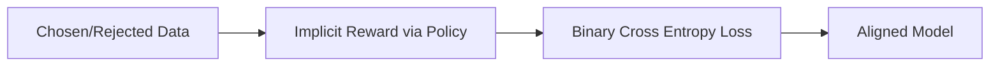

# The Direct Mathematical Reparameterization Revolution

Deep dive into Direct Preference Optimization (DPO).

## Diagram

```mermaid
flowchart LR
    A[Chosen/Rejected Data] --> B[Implicit Reward via Policy]
    B --> C[Binary Cross Entropy Loss]
    C --> D[Aligned Model]
```

[Back to README](README.md)
