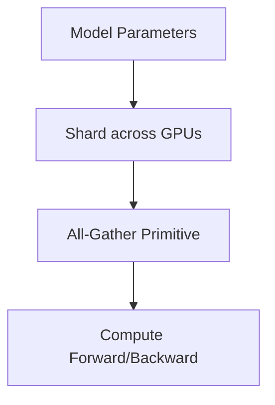

# Fully Sharded Parameter Storage (FSDP)

Slashing VRAM overheads via sharding.

## Diagram

```mermaid
flowchart TD
    A[Model Parameters] --> B[Shard across GPUs]
    B --> C[All-Gather Primitive]
    C --> D[Compute Forward/Backward]
```

[Back to README](README.md)
