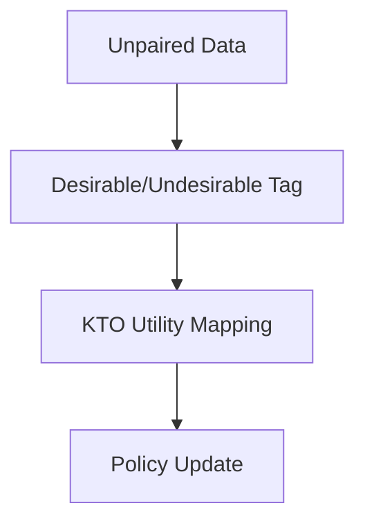

# Kahneman-Tversky Optimization (KTO)

Applying Prospect Theory to model alignment.

## Diagram

```mermaid
flowchart TD
    A[Unpaired Data] --> B[Desirable/Undesirable Tag]
    B --> C[KTO Utility Mapping]
    C --> D[Policy Update]
```

[Back to README](README.md)
