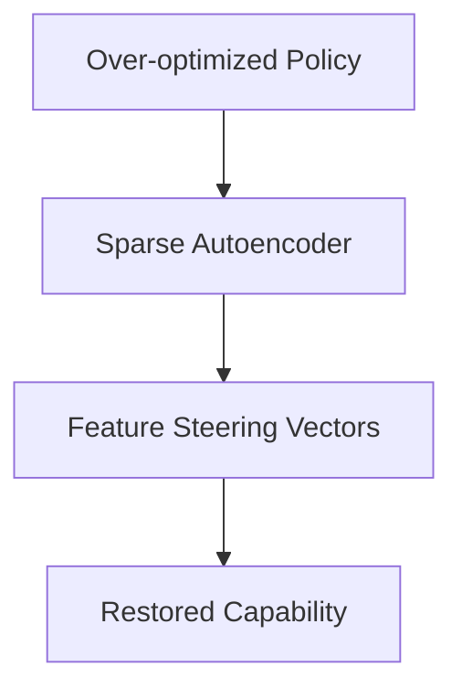

# The Likelihood Saturation Wall

Addressing capability collapse through Sparse Autoencoders.

## Diagram

```mermaid
flowchart TD
    A[Over-optimized Policy] --> B[Sparse Autoencoder]
    B --> C[Feature Steering Vectors]
    C --> D[Restored Capability]
```

[Back to README](README.md)
