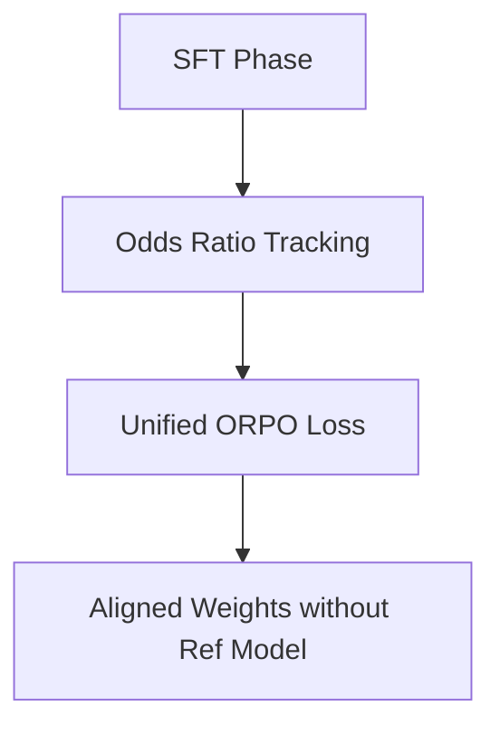

# Odds Ratio Preference Optimization (ORPO)

Unified loss calculation without a reference model.

## Diagram

```mermaid
flowchart TD
    A[SFT Phase] --> B[Odds Ratio Tracking]
    B --> C[Unified ORPO Loss]
    C --> D[Aligned Weights without Ref Model]
```

[Back to README](README.md)
