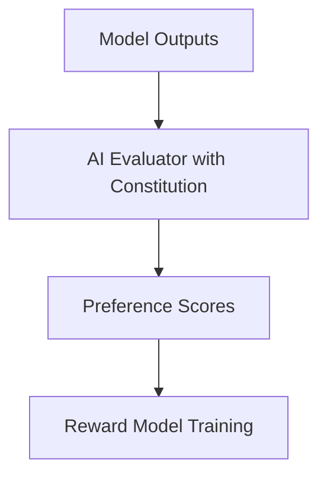

# Reinforcement Learning from AI Feedback (RLAIF)

Using an AI Constitution to tag preference data.

## Diagram

```mermaid
flowchart TD
    A[Model Outputs] --> B[AI Evaluator with Constitution]
    B --> C[Preference Scores]
    C --> D[Reward Model Training]
```

[Back to README](README.md)
