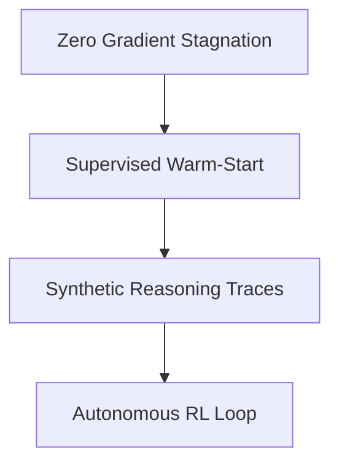

# The Sparse Gradient Stagnation Wall

Warm-start curriculum for compiler-verified environments.

## Diagram

```mermaid
flowchart TD
    A[Zero Gradient Stagnation] --> B[Supervised Warm-Start]
    B --> C[Synthetic Reasoning Traces]
    C --> D[Autonomous RL Loop]
```

[Back to README](README.md)
