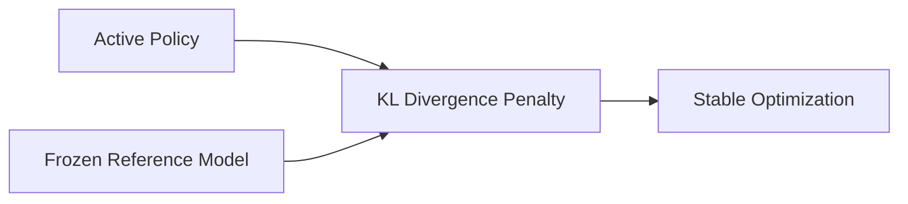

# Symmetric KL-Divergence Constraints

Anchoring token drift to prevent model collapse.

## Diagram

```mermaid
flowchart LR
    A[Active Policy] --> B[KL Divergence Penalty]
    C[Frozen Reference Model] --> B
    B --> D[Stable Optimization]
```

[Back to README](README.md)
