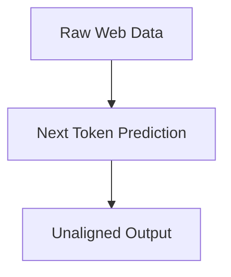

# The Unaligned Generative Baseline Era

A detailed look into the pre-2022 era where models were optimized purely on next-token prediction without alignment.

## Diagram

[Back to README](README.md)
